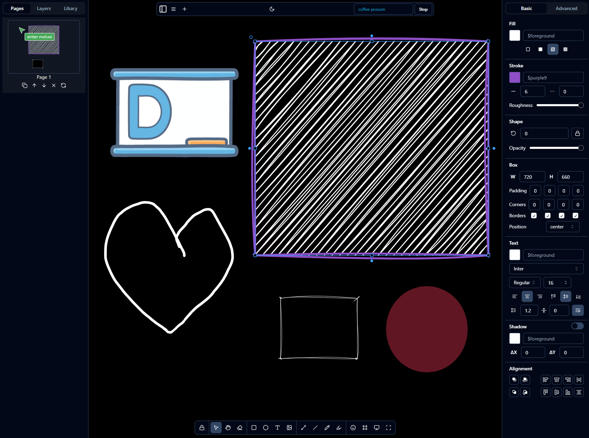

# Draw Web App

[Draw Web App](https://meatbyte-studio.github.io/draw-server/) using [DGM.js](https://github.com/dgmjs/dgmjs).

## Features

- Created a dedicated Draw Web App based on [demo app](https://github.com/dgmjs/dgmjs/blob/main/apps/demo/README.md)
- Improved collaboration mode
- Improved styling for light mode and dark mode
- Added self-contained server to serve the html files and y-webrtc server.

## Container Images

[Draw Web App](https://meatbyte-studio.github.io/draw-server/) is a self-contained image that serves the draw web app and the y-webrtc server within a very simple node server.js script.

https://ghcr.io/meatbyte-studio/draw-server:latest

[K8s-manifest-example.yaml](draw-server/k8s-manifest-example.yaml)

## Environment Variables

| Variable             | Description               | Default Value | Note                                                                                                                                                                |
| -------------------- | ------------------------- | ------------- | ------------------------------------------------------------------------------------------------------------------------------------------------------------------- |
| `PORT`               | Port to run server        | `"4444"`      |                                                                                                                                                                     |
| `SIGNALING_URLS`     | URLs for signaling server | `"*"`         | If it is `"*"`, then the frontend will just replace https/http with wss/ws. Otherwise, you can pass in comma separated values: `"draw.example.com,draw.google.com"` |
| `SIGNALING_PASSWORD` | Password for signaling    | `""`          | Auto-generated on server start if empty                                                                                                                             |

## Y-webrtc via Params

You can pass in params to the url to specify a signaling server and the signaling password.

https://meatbyte-studio.github.io/draw-server/?signalingUrl=wss://webrtc.example.com&signalingPassword=amarikapye

Note: webrtc.example.com is not an actual y-webrtc server.

## Running dev mode

From the root directory:

```sh
# build all packages
$ npm run build --workspaces

# run demo app
$ npm run dev -w draw
```

# Original README.md

Codebase is forked from [DGM.js](https://github.com/dgmjs/dgmjs)


# DGM.js


An infinite canvas with _smart shapes_. It supports:

- 💡 Smart shapes (scripting, constraints, extended properties)
- 🔧 Headless components (React)
- 🔥 Infinite canvas
- 📑 Multi-page support
- 👍 Hand-drawn styles
- 👥 Real-time collaboration
- 🎨 Dark mode (adaptive colors)
- 📸 Export to image (PNG, JPEG, WebP, SVG)
- 📕 Export to PDF
- 🔤 Rich text
- 🧑🏻‍💻 JSON export/import

## Getting started

- [Get started](https://dgmjs.dev/overview/getting-started/)
- [Minimal example (StackBlitz)](https://stackblitz.com/edit/dgmjs-example?file=src%2Fapp.tsx)
- [Run demo app](https://github.com/dgmjs/dgmjs/blob/main/apps/demo/README.md)

## Showcase

- [Frame0](https://frame0.app) - Sketch-style low-fi wireframing tool
- [DGM App](https://dgm.sh/home) - Full-featured web-based sketchnotes app
- [draw2app](https://draw2app.pages.dev/) - Generate web app from low-fidelity sketch by OpenAI.

## Contribution

Please note that this project is **not open contribution**, so we do not accept any pull requests.

## License

DGM.js is distributed under the _GPLv3 license_. If you want non-GPL license, please see our [licensing options](https://dgmjs.dev/overview/license/).


# DGM.js


An infinite canvas with _smart shapes_. It supports:

- 💡 Smart shapes (scripting, constraints, extended properties)
- 🔧 Headless components (React)
- 🔥 Infinite canvas
- 📑 Multi-page support
- 👍 Hand-drawn styles
- 👥 Real-time collaboration
- 🎨 Dark mode (adaptive colors)
- 📸 Export to image (PNG, JPEG, WebP, SVG)
- 📕 Export to PDF
- 🔤 Rich text
- 🧑🏻‍💻 JSON export/import

## Getting started

- [Get started](https://dgmjs.dev/overview/getting-started/)
- [Minimal example (StackBlitz)](https://stackblitz.com/edit/dgmjs-example?file=src%2Fapp.tsx)
- [Run demo app](https://github.com/dgmjs/dgmjs/blob/main/apps/demo/README.md)

## Showcase

- [Frame0](https://frame0.app) - Sketch-style low-fi wireframing tool
- [DGM App](https://dgm.sh/home) - Full-featured web-based sketchnotes app
- [draw2app](https://draw2app.pages.dev/) - Generate web app from low-fidelity sketch by OpenAI.

## Contribution

Please note that this project is **not open contribution**, so we do not accept any pull requests.

## License

DGM.js is distributed under the _GPLv3 license_. If you want non-GPL license, please see our [licensing options](https://dgmjs.dev/overview/license/).
